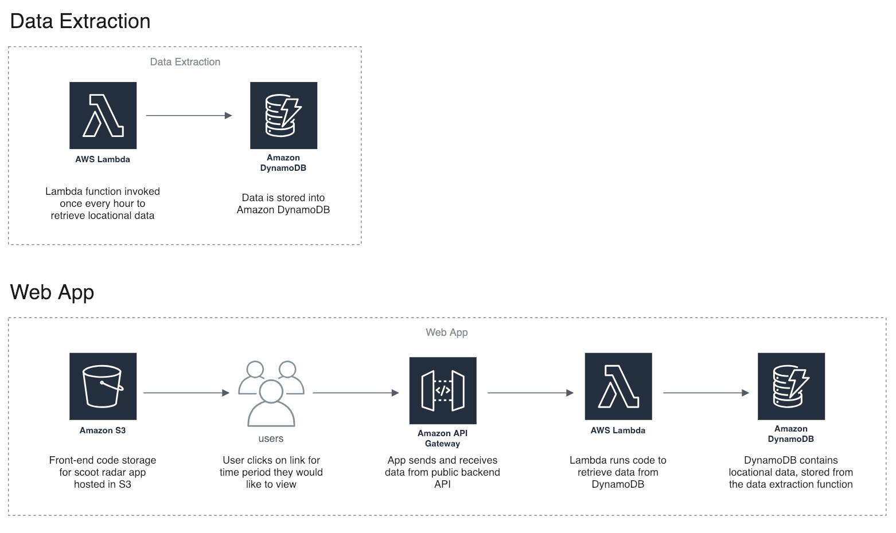

<!-- markdownlint-disable MD034 -->

# Scoot Radar #

## Intro ##

This application will be a web app which displays locational data for e-scooters overtime around Tempe. The goal is have a sort of weather radar visualization in the end, with hourly heatmap displays of scooters within about a mile radius of ASU.  

The app will be serverless and cloud based, optimized for use with AWS services. The core application logic will rely on serverless compute functionality with AWS Lambda https://aws.amazon.com/lambda/. Application data storage will utilize Amazon's non relational database service DynamoDB https://aws.amazon.com/dynamodb/. Web app front end files will be statically hosted via Amazon S3 https://aws.amazon.com/s3/. Communication between app front and serverless back end will be made possible via Amazon API Gateway https://aws.amazon.com/api-gateway/. Application monitoring and error tracing will be made possible through Amazon CloudWatch https://aws.amazon.com/cloudwatch/.  

The application will be split into two components, one for the purpose of extracting data from the e-scooter APIs, and the other for the web app which will display the data.  



## Data Extraction ##

### Data Extract Pseudocode ###

We can set lambda functions to execute on a set interval, so about once an hour we will want to have a function run which requests the locational data for nearby scooters from the current publically available e-scooter APIs. We will then take only the data we are interested in (scooter id, longitutde, latitude, company), and we will store that data as a record associated with that specific time interval into our nonrelational database.

```text
Lambda function invoked on a set interval:
  Bird:
    Need a login token, valid for 24 hours
      Will need to grab a new token from a valid email every 24 hours (see MailParser)
    Request nearby birds using ASU lat/long and token (while token is active)
    Store necessary data in DynamoDB
  Lime:
    Need bearer and cookie
      Seems to only need to be generated once, see See https://github.com/ubahnverleih/WoBike/blob/master/Lime.md for more info on this specific API
    Endpoint https://web-production.lime.bike/api/rider
    Include ASU lat/long, as well as bearer and cookie
    Under "attributes" for returned data, take those with "vehicle_type": "scooter"
    Store necessary data in DynamoDB
  Razor:
    does not yet seem to have public API
```

### Example Implementation ###

The following goes over an example for getting scooter data using the bird api. Node package manager module 'node-bird' is a wrapper module for the publicly accessbile Bird API.  

We first need to include the necessary npm modules for our app to work, as well as set some constants to be used throughout our function. We also have to declare and instantiate an instance of our Bird object.

``` js
const Bird = require('node-bird')
const bird = new Bird()
const prompt = require("prompt-async");

const SCOOT_RANGE_MI = 1;
const SCOOT_INTERVAL_MS = 600000; // 10 min
const ASU_LONG = 33.4166061;
const ASU_LAT = -111.9363706;
```

We then delcare an async function for utilizing the methods included within the Bird object.

``` js
async function init() {
    try {
        await bird.login('fitz00000@gmail.com')
        prompt.start();
        const {
            verifyCode
        } = await prompt.get(['verifyCode']);
        await bird.verifyEmail(verifyCode);
        getScoots();
    } catch (err) {
        console.log(err)
    }
}
```

Once the email verification occurs after user login, we are able to request Bird scooter data for the TTL of the token generated (24 hours). `getScoots` may be called on an interval at this point like `setInterval(getScoots, SCOOT_INTERVAL_MS)`, but for the purpose of the example the method is only being called once.

``` js
async function getScoots() {
    let scoots = await bird.getScootersNearby(ASU_LONG, ASU_LAT, SCOOT_RANGE_MI);
    console.log(scoots);
}

init();
```

In our implementation example, bird scooter data is logged to the console. For the purposes of the actual function execution, this data will be stored into our noSQL db.

``` js
[ { id: '36ed5c8a-1b0b-4da9-85e8-c1560641e8d7',
    location: { latitude: 33.41589, longitude: -111.93650833333335 },
    code: '',
    captive: false,
    battery_level: 56 },
  { id: 'e70c5ca1-134b-4e9c-b94e-fcb6dc3d4a86',
    location: { latitude: 33.418125, longitude: -111.93025166666666 },
    code: '',
    captive: false,
    battery_level: 48 },
  { id: 'd25ecabe-67e5-4686-ab85-a41c4c966285',
    location: { latitude: 33.421902, longitude: -111.937091 },
    code: '',
    captive: false,
    nest_id: '4f3ee229-9c85-4496-a8ca-c66da53cbe7b',
    battery_level: 100 },
  ... 150 more items ]
```

## Web App ##

The web app will be resonsible for displaying data extracted from the previous component of the solution. A service like D3js may be used for the geographical data visualization, while Angular 7 or just simple ajax / javascript xhttp calls will be used for requesting data from the API Gateway endpoint.

### Web App Pseudocode ###

``` text
- Static web files hosted on Amazon S3:
- On user click for specified time period, ajax REST API call to API Gateway endpoint
- Lambda function invoked, queries DynamoDB for array of scoot data over that time period (this is hourly)
- Data is returned to front end, data for selected hour is displayed via geographical data visualization
  - D3js for data visualization https://d3js.org/

(Only time we need the API is for selecting a specific time frame. Data will already be present for subsequent hourly changes in the display)
```